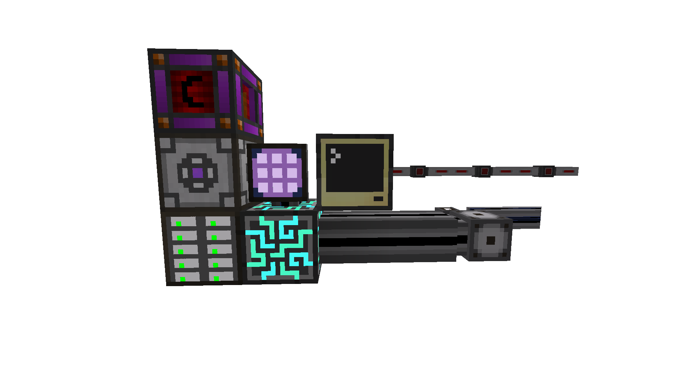

## Description
The AE Autocrafting Request System is a system that is used to automatically request crafting jobs for specific items.
The system itself comprises of multiple different components: a ComputerCraft or CC:Tweaked computer, redstone conduits 
from EnderIO, and ME export buses with redstone and autocrafting cards. 

However, it should be noted that this system was built within the FTB Infinity Evolved modpack for MC 1.7.10. Which at the time did not have a way to submit a crafting request directly to the AE system using a ComputerCraft or CC:Tweaked computer.

## Setup
### Installation
Install the program by copying and pasting the code from `startup` in this repository into the file of the same name on your computer. Relative to the minecraft directory, the location where the in-game files for your computer are stored is `~/minecraft/saves/world_name/computer/num_index_of_computer`. I would tell you to use the `pastebin` command within the computer itself, however it no longer works as the pastebin API has since changed. That said, the startup script serves to automatically update the main script when the `programs/AE-Autocrafting-Request-System.lua` file is edited on the master branch.

### Configuring
When the program first runs it will generate a configuration file called `resources.config` and ask you to add some enteries.
The configuration can look a little complex so I'll provide an example.

```
# ID,DMG,lowThreshhold,COLOR,SIDE,PULSE
#
# ID -            The ID of the item. 
#                 This is a string.
#
# DMG -           The damage value of the item.
#                 This is an int.
#
# lowThreshhold - The minimal amount the AE network will
#                 try to keep within the system.
#                 This is an int.
#
# COLOR -         The channel color the redstone output
#                 will be outputted on. This is used by
#                 bundled cables to transmit multiple
#                 redstone signals on the same wire.
#                 This is an int.
#
# SIDE -          The side of the computer that will emit
#                 a redstone signal on COLOR. 
#                 This is a string.
#
# PULSE -         Controls whether or not the redstone
#                 signal will pulse in 5 second intervals.
#                 This is to mitigate a bug in AE where
#                 a redstone signal appears to "halt"
#                 the system.
#                 This is a boolean.
# 
# In-order for the changes in this configuration file to
# take effect, the system will need to be rebooted.


# Charged Certus Quartz
appliedenergistics2:item.ItemMultiMaterial,1,100,16384,left,true

# Fluix Crystal
appliedenergistics2:item.ItemMultiMaterial,7,100,8192,left,true

# Logic Processor
appliedenergistics2:item.ItemMultiMaterial,22,100,4096,left,true

# Calculation Processor
appliedenergistics2:item.ItemMultiMaterial,23,100,2048,left,true

# Engineering Processor
appliedenergistics2:item.ItemMultiMaterial,24,100,1024,left,true

# Smooth Stone
minecraft:stone,0,100,32768,left,false
```
Also, you might of noticed that the value for color is provided as an integer. This being the case here is the full list of possible colors:
```
# Colors
white     1
orange    2
magenta   4
lightBlue 8
yellow    16
lime      32
pink      64
gray      128
lightGray 256
cyan      512
purple    1024
blue      2048
brown     4096
green     8192
red       16384
black     32768
```

### Setting up the ME network
The computer will output a redstone signal on a specific redstone channel when the item configured for that channel falls below the specified minimum. We connect redstone conduits to the ME export buses to supply them with a redstone signal. The export buses are told to only export when a redstone signal is provided, and to always submit a crafting request when exporting. Additionally, each interface along the redstone conduit will need to be configured for a specific redstone channel.

An example of an autocrafting request system:
<div align="center">
  
</div>

An example of an export bus configuration:
<div align="center">
  
</div>

To connect the computer to the ME network, place it next to an ME cable:
<div align="center">
  
</div>
